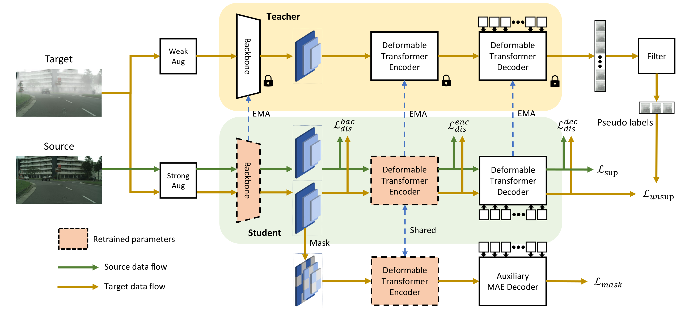

# MRT
Official implementation for paper: **Masked Retraining Teacher-student Framework for Domain Adaptive Object Detection**

By Zijing Zhao, Sitong Wei, Qingchao Chen, Dehui Li, Yifan Yang, Yuxin Peng and Yang Liu

The paper has been accepted by **IEEE/CVF International Conference on Computer Vision (ICCV), 2023**



Domain adaptive Object Detection (DAOD) leverages a labeled domain (source) to learn an object detector generalizing to a novel domain without annotation (target). Recent advances use a teacher-student framework, i.e., a student model is supervised by the pseudo labels from a teacher model. Though great success, they suffer from the limited number of pseudo boxes with incorrect predictions caused by the domain shift, misleading the student model to get sub-optimal results. To mitigate this problem, we propose Masked Retraining Teacher-student framework (MRT) which leverages masked autoencoder and selective retraining mechanism on detection transformer. Experiments show that our method outperforms existing approaches and achieves state-of-the-art on three domain adaptive object detection benchmarks.

We use [Deformable DETR](https://github.com/fundamentalvision/Deformable-DETR) as the base detector. This code is built upon the original repository: https://github.com/fundamentalvision/Deformable-DETR, we thank for their excellent work.


## 1. Installation

### 1.1 Requirements

- Linux, CUDA >= 11.1, GCC >= 8.4

- Python >= 3.8

- torch >= 1.10.1, torchvision >= 0.11.2

- Other requirements

  ```bash
  pip install -r requirements.txt
  ```

### 1.2 Compiling Deformable DETR CUDA operators

```bash
cd ./models/ops
sh ./make.sh
# unit test (should see all checking is True)
python test.py
```


## 2. Usage

### 2.1 Data preparation

We provide the 2 benchmarks in our paper: 

- city2foggy: cityscapes dataset is used as source domain, and foggy_cityscapes(0.02) is used as target domain.
- sim2city: sim10k dataset is used as source domain, and cityscapes which only record AP of cars is used as target domain.
- city2bdd: cityscapes dataset is used as source domain, and bdd100k-daytime is used as target domain.

You can download the raw data from the official websites: [cityscapes](https://www.cityscapes-dataset.com/downloads/),  [foggy_cityscapes](https://www.cityscapes-dataset.com/downloads/),  [sim10k](https://fcav.engin.umich.edu/projects/driving-in-the-matrix), [bdd100k](https://bdd-data.berkeley.edu/). We provide the annotations that are converted into coco style, download from [here](https://drive.google.com/file/d/1LB0wK9kO3eW8jpR2ZtponmYWe9x2KSiU/view?usp=sharing) and organize the datasets and annotations as following:

```bash
[data_root]
└─ cityscapes
	└─ annotations
		└─ cityscapes_train_cocostyle.json
		└─ cityscapes_train_caronly_cocostyle.json
		└─ cityscapes_val_cocostyle.json
		└─ cityscapes_val_caronly_cocostyle.json
	└─ leftImg8bit
		└─ train
		└─ val
└─ foggy_cityscapes
	└─ annotations
		└─ foggy_cityscapes_train_cocostyle.json
		└─ foggy_cityscapes_val_cocostyle.json
	└─ leftImg8bit_foggy
		└─ train
		└─ val
└─ sim10k
	└─ annotations
		└─ sim10k_train_cocostyle.json
		└─ sim10k_val_cocostyle.json
	└─ JPEGImages
└─ bdd10k
	└─ annotations
		└─ bdd100k_daytime_train_cocostyle.json
		└─ bdd100k_daytime_val_cocostyle.json
	└─ JPEGImages
```

To use additional datasets, you can edit [datasets/coco_style_dataset.py](https://github.com/JeremyZhao1998/MRT-release/blob/main/datasets/coco_style_dataset.py) and add key-value pairs to `CocoStyleDataset.img_dirs` and `CocoStyleDataset.anno_files` .

### 2.2 Training and evaluation

As has been discussed in implementation details in the paper, to save computation cost, our method is designed as a three-stage paradigm. We first perform `source_only` training which is trained standardly by labeled source domain. Then, we perform `cross_domain_mae` to train the model with MAE branch. Finally, we perform `teaching` which utilize a teacher-student framework with MAE branch and selective retraining.

For example, for `city2foggy` benchmark, first edit the files in `configs/def-detr-base/city2foggy/` to specify your own `DATA_ROOT` and `OUTPUT_DIR`, then run:

```bash
sh configs/def-detr-base/city2foggy/source_only.sh
sh configs/def-detr-base/city2foggy/cross_domain_mae.sh
sh configs/def-detr-base/city2foggy/teaching.sh
```

We use `tensorboard` to record the loss and results. Run the following command to see the curves during training: 

```bash
tensorboard --logdir=<YOUR/LOG/DIR>
```

To evaluate the trained model and get the predicted results, run:

```bash
sh configs/def-detr-base/city2foggy/evaluation.sh
```


## 3. Results and Model Parameters

We conduct all experiments with batch size 8 (for source_only stage, 8 labeled samples; for cross_domain_mae and MRT teaching stage, 8 labeled samples and 8 unlabeled samples), on 2 NVIDIA A100 GPUs.

**city2foggy**: cityscapes → foggy cityscapes(0.02)

| backbone | encoder layers | decoder layers | training stage   | AP@50 | logs & weights                                               |
| -------- | -------------- | -------------- | ---------------- | ----- | ------------------------------------------------------------ |
| resnet50 | 6              | 6              | source_only      | 29.5  | [logs](https://drive.google.com/file/d/1O-B-OXBf8clOSNMJLtJEPuNQvo5W2CuU/view?usp=drive_link) & [weights](https://drive.google.com/file/d/1J6PpDsKvWvTJthwctFuYV8kUEnGGTVUk/view?usp=drive_link) |
| resnet50 | 6              | 6              | cross_domain_mae | 35.8  | [logs](https://drive.google.com/file/d/1gUYJDX9eE5FIKWMbR_tK6leMnM5q06dj/view?usp=sharing) & [weights](https://drive.google.com/file/d/1X-STx26799Q2vAUle1QjXj_1gzwvZrRk/view?usp=drive_link) |
| resnet50 | 6              | 6              | MRT teaching     | 51.2  | [logs](https://drive.google.com/file/d/1YwLUo3t2KJ1pjENFAr5vECZlrRFWwKG2/view?usp=sharing) & [weights](https://drive.google.com/file/d/1BooqcIdzP97I3ax7JN6ULZWoZcvRKLlm/view?usp=sharing) |

**sim2city**: sim10k → cityscapes(car only)

| backbone | encoder layers | decoder layers | training stage   | AP@50 | logs & weights                                               |
| -------- | -------------- | -------------- | ---------------- | ----- | ------------------------------------------------------------ |
| resnet50 | 6              | 6              | source_only      | 53.2  | [logs](https://drive.google.com/file/d/1qfdHLuUX8N3SRUTNmclf0Y3PJ-deOF4r/view?usp=sharing) & [weights](https://drive.google.com/file/d/1mkqKxrWannqJN1_tJdh76t7ZAGIzDsIs/view?usp=sharing) |
| resnet50 | 6              | 6              | cross_domain_mae | 57.1  | [logs](https://drive.google.com/file/d/1bDNux81HhHZhmuoABwU-N4ALZFjKQWHR/view?usp=drive_link) & [weights](https://drive.google.com/file/d/14cTFm8pM9DmN2UcV7NGaMJxOJVfOvANP/view?usp=sharing) |
| resnet50 | 6              | 6              | MRT teaching     | 62.0  | [logs](https://drive.google.com/file/d/1S_GiAb9Ujfndh6XHnBz6qmCawpEDY102/view?usp=sharing) & [weights](https://drive.google.com/file/d/1dsSuk24_jEq3k4DBpoPr4AH3mxL0DspP/view?usp=sharing) |

**city2bdd**: cityscapes → bdd100k(daytime)

| backbone | encoder layers | decoder layers | training stage   | AP@50 | logs & weights                                               |
| -------- | -------------- | -------------- | ---------------- | ----- | ------------------------------------------------------------ |
| resnet50 | 6              | 6              | source_only      | 29.6  | [logs](https://drive.google.com/file/d/1KIydqXkj0LIlDlHHDW4TfxIh3-rmaWQM/view?usp=drive_link) & [weights](https://drive.google.com/file/d/1IAzbKozA_Rq-2H-KzdcvGp3LGJrZ4J5G/view?usp=drive_link) |
| resnet50 | 6              | 6              | cross_domain_mae | 31.1  | [logs](https://drive.google.com/file/d/1gUYJDX9eE5FIKWMbR_tK6leMnM5q06dj/view?usp=drive_link) & [weights](https://drive.google.com/file/d/1X-STx26799Q2vAUle1QjXj_1gzwvZrRk/view?usp=drive_link) |
| resnet50 | 6              | 6              | MRT teaching     | 33.7  | [logs](https://drive.google.com/file/d/13jgRrsKVDap0O9rUiY-ZhZp-kL6di4EH/view?usp=sharing) & [weights](https://drive.google.com/file/d/1VRtNy_2bXdkpLr1h6v-ZusEuTR7hAu_v/view?usp=sharing) |


## 4. Citation

This repository is constructed and maintained by [Zijing Zhao](https://jeremyzhao1998.github.io/) and [Sitong Wei](https://github.com/wst2001).

If you find our paper or project useful, please cite our work by the following BibTeX:

```
@inproceedings{zhao2023masked,
  title={Masked retraining teacher-student framework for domain adaptive object detection},
  author={Zhao, Zijing and Wei, Sitong and Chen, Qingchao and Li, Dehui and Yang, Yifan and Peng, Yuxin and Liu, Yang},
  booktitle={Proceedings of the IEEE/CVF International Conference on Computer Vision},
  pages={19039--19049},
  year={2023}
}
```

Thanks for your attention.